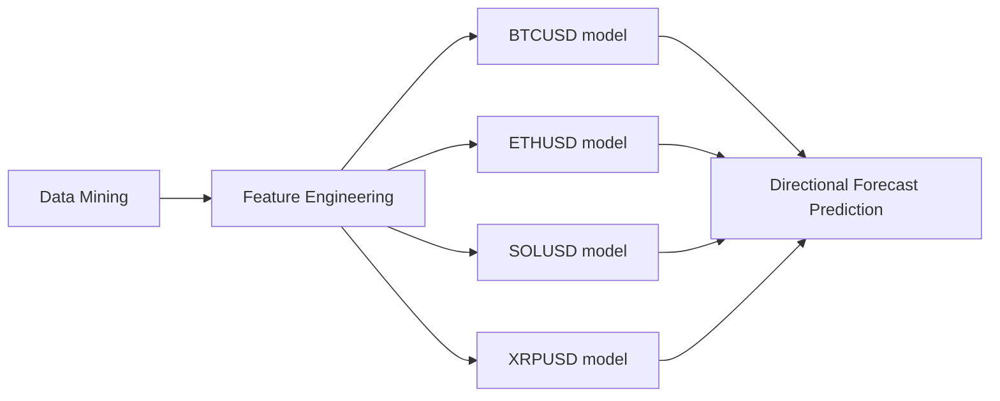

# XGBoost Directional Prediction Algorithm for BTCUSD, ETHUSD, SOLUSD, XRPUSD: 1 hour Polymarket Contract #


## Description
V2 of quantitative strategy aimed to target the 1 hour crypto predictions on polymarket. This version integrates concepts of asset cross-correlation with the previous existing XGBoost mechanism for high probability price directional identification. By collating all feature sets together, the model should expect to see an improvement in directional prediction accuracy from the V1 model where accuracy was 53-54% -> we should expect to see the values increase to around 55%+.

Below is a diagram of the pipeline:




## Maintainance & Implications
There are frequent occurance where maintainance is required: such as monthly recalibration and/or vast underperformance over a set period. By navigating through the file directory you can locate the correct files.

#### File Directory

Maintainance will require in-depth knowledge of the directory

Algorithm:
```
├── algorithm/
|   ├── clients/
|   |   ├── collection_agent.py
|   |   ├── trade_entry_agent.py
|   |   └── trade_exit_agent.py
|   ├── production/
|   |   └── live_model.pkl
|   ├── setup/
|   |   ├── claim.py
|   |   └── set_up_wallet.py
|   ├── storage/
|   |   ├── data_attributes.py
|   |   ├── memory.py
|   |   └── trade_logs.csv
|   ├── strategy/
|   |   └── engine.py
|   ├── config.py
|   └── main.py (run script)
```

Analysis:
```
├── analysis/
|   ├── _1data_collection.py
|   ├── _2data_check.py
|   ├── _3clean_and_engineer.py
|   ├── _4data_split.py
|   ├── _5backtest.py
|   ├── _6forward_testing.py
|   ├── _7permutation.py
|   └── _8model_creation.py
```

#### Model Recalibration
Every month recalibrate the models by going to the analysis directory and conducting the following actions

1) evaluate the previous model performance by using script 5, compare to live results
2) run in order scripts 1-4, 6-8
3) create new model, save parameters and track basic model statistics
4) run new live model

#### Risk Management
Position size determined by the kelly fraction, ensure that model does not exceed tail risk thresholds for tolerance, else recalibrate or stop the model.

tail risk thresholds includes:
- exceeds walkforward (testing) max-consecutive loss streak
- exceeds walkforward (testing) avg-consecutive loss streak
- monthly live win-rate degradation below 48% for
    * month since model inception
    * 5 day-average
    * 3 day-average

#### Tracking
Ensure to update spreadsheet of monthly trade logs upon recalibration period. Furthermore clear the previous trade-logs to free up space.

#### Future Considerations
An effort to expand to retrieve additional volume or microstructure dynamics should be considered as the viability of this strategy using the current feature set is likely to wane lower than the 51% prediction accuracy mark. Should the win-rate ever start to show consistant degradation below the 51% mark, the strategy should deprecated.


## Statements
This strategy was conducted in 2026 during the rise of prediction markets. Despite its surge in popularity, the geographical operability renders this strategy unviable given its widespread prohibition.


DISCLAIMER:
-----------
This software is provided "as is", without warranty of any kind, express or
implied. The author(s) accept no responsibility or liability for any financial
losses, damages, or consequences arising from the use of this software.

This strategy has been formally deprecated. Historical performance does not
guarantee future results. Prediction market conditions, regulatory environments,
and model viability can change at any time.

By using this software, you acknowledge that:
  - You are doing so entirely at your own risk
  - No ongoing support or maintenance will be provided
  - The author(s) are not responsible for any outcomes
  - This is not financial advice
