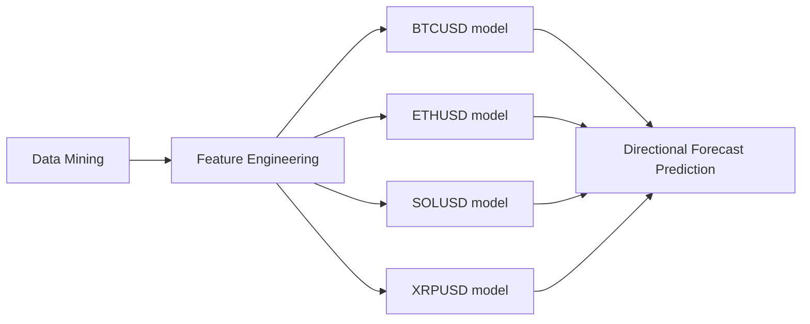

# XGBoost Directional Prediction Algorithm for BTCUSD, ETHUSD, SOLUSD, XRPUSD: 1 hour Polymarket Contract #


## Description
V2 of quantitative strategy aimed to target the 1 hour crypto predictions on polymarket. This version integrates concepts of asset cross-correlation with the previous existing XGBoost mechanism for high probability price directional identification. By collating all feature sets together, the model should expect to see an improvement in directional prediction accuracy from the V1 model where accuracy was 53-54% -> we should expect to see the values increase to around 55%+.

Below is a diagram of the pipeline:




## Maintainance & Implications
There are frequent occurance where maintainance is required: such as monthly recalibration and/or vast underperformance over a set period. By navigating through the file directory you can locate the correct files.

#### File Directory

Maintainance will require in-depth knowledge of the directory

Algorithm:
```
├── algorithm/
|   ├── clients/
|   |   ├── collection_agent.py
|   |   ├── trade_entry_agent.py
|   |   └── trade_exit_agent.py
|   ├── production/
|   |   └── live_model.pkl
|   ├── setup/
|   |   ├── claim.py
|   |   └── set_up_wallet.py
|   ├── storage/
|   |   ├── data_attributes.py
|   |   ├── memory.py
|   |   └── trade_logs.csv
|   ├── strategy/
|   |   └── engine.py
|   ├── config.py
|   └── main.py (run script)
```

Analysis:
```
├── analysis/
|   ├── _1data_collection.py
|   ├── _2data_check.py
|   ├── _3clean_and_engineer.py
|   ├── _4data_split.py
|   ├── _5backtest.py
|   ├── _6forward_testing.py
|   ├── _7permutation.py
|   └── _8model_creation.py
```

#### Model Recalibration
Every month recalibrate the models by going to the analysis directory and conducting the following actions

1) evaluate the previous model performance by using script 5, compare to live results
2) run in order scripts 1-4, 6-8
3) create new model, save parameters and track basic model statistics
4) run new live model

#### Risk Management
Position size determined by the kelly fraction, ensure that model does not exceed tail risk thresholds for tolerance, else recalibrate or stop the model.

tail risk thresholds includes:
- exceeds walkforward (testing) max-consecutive loss streak
- exceeds walkforward (testing) avg-consecutive loss streak
- monthly live win-rate degradation below 48% for
    * month since model inception
    * 5 day-average
    * 3 day-average

#### Tracking
Ensure to update spreadsheet of monthly trade logs upon recalibration period. Furthermore clear the previous trade-logs to free up space.

#### Future Considerations
An effort to expand to retrieve additional volume or microstructure dynamics should be considered as the viability of this strategy using the current feature set is likely to wane lower than the 51% prediction accuracy mark. Should the win-rate ever start to show consistant degradation below the 51% mark, the strategy should retired.


## Statements
Final regards and statements on this strategy.

#### Rationale Statement
Strategy was conducted in 2026 during the rise of prediction markets. This strategy is part two of an existing strategy.

#### Final Statement
A letter to my future self, whom I know is currently successful - this marks a significant checkpoint in my journey.


NOTICE:
-------
© 2026 Shayen Kesha.
All rights reserved. This software is protected by copyright law. No part of this algorithm may be reproduced or transmitted in any form without prior written permission.